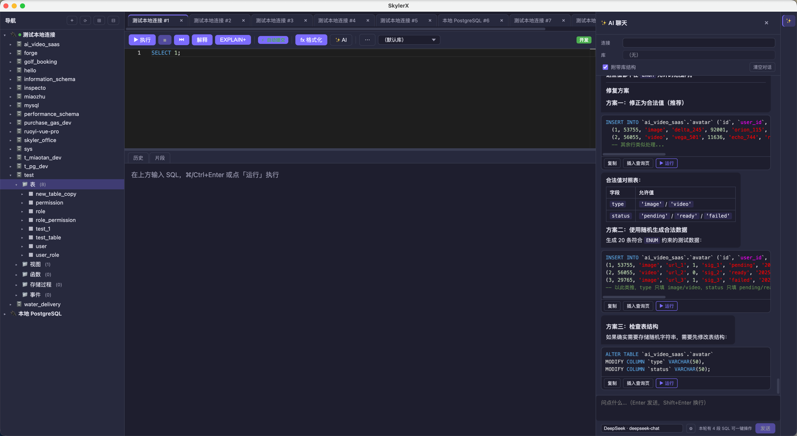

<div align="right">

**简体中文** | [English](./README.md)

</div>

# SkylerX

跨平台桌面**数据库管理工具**（类 Navicat / DBeaver），Electron + Vue 3 + Vite + TypeScript。

[](https://github.com/duhbbx/SkylerX/releases/latest)
[](https://github.com/duhbbx/SkylerX/releases)
[](./LICENSE)

> GitHub 主页右侧 "Latest" 徽标按 semver 语义指向最新 **stable**；当前正在 **预发布（`-rc`）** 阶段，看上方橙色徽章拿动态最新 rc 版本。桌面端自动更新和[下载页](https://skylerx.skyler.uno/download)始终跟最新 pre-release，等 v0.5.0 stable 发出再换。

> **许可**：[Apache License 2.0](./LICENSE)



> ⚠️ **免责声明 / 项目状态**
>
> SkylerX 仍在持续开发中，**尚未经过生产环境的完整测试**。当前测试覆盖率有限，跨方言的边界场景未全部验证，次版本之间可能出现破坏性变更。
>
> - **使用风险自负**。Apache License 2.0 以「按现状」（AS IS）方式提供本软件，不附带任何明示或暗示的担保（详见 [LICENSE](./LICENSE) §7–8）。
> - **在执行任何写入、改表、数据同步或迁移操作前，务必先备份数据库。**
> - 建议先在 dev / staging 环境的连接上评估使用；生产连接请打上 `prod` 标记（应用会强制二次确认），破坏性 SQL 先 `EXPLAIN` / dry-run 验证。
> - 在发布稳定的 1.0 版本之前，建议把 SkylerX 视为**开发者 / 高级用户工具**，而不是托管型 DBA 平台。
>
> 欢迎通过 [GitHub Issues](https://github.com/duhbbx/SkylerX/issues) 提交 bug 与复现步骤——这些会直接进入加固待办列表。

## 关于

**武汉斯凯勒网络科技有限公司**（Wuhan Skyler Network Technology Co., Ltd.）

SkylerX 由武汉斯凯勒网络科技有限公司开发并维护。

**承接外包开发与项目合作。** 主要服务方向：

- 🛠 **全栈 Web 开发**（Vue / React / Node / Go / Java）
- 🖥 **桌面端应用**（Electron / Tauri，多平台打包与自动更新）
- 🗄 **数据库咨询**：选型、表结构设计、性能调优、迁移（含 Oracle / SQL Server → MySQL / PostgreSQL / 国产数据库 等方向）
- 🔄 **Navicat / DataGrip 企业替代方案**落地与定制
- 🏢 **私有化 / 离网部署** 与私有云构建（含 信创 / 国产化 环境）
- 📊 **数据平台**：ETL 流水线、看板、数据仓库（ClickHouse / Snowflake / DuckDB）搭建
- 🤖 **AI 集成**：LLM API 网关、内部数据 RAG、Agent 工作流、本地推理部署
- 🛡 **DevOps & SRE**：CI/CD、可观测性、多云 / 混合云部署

欢迎联系：

| 渠道 | 联系方式 |
| --- | --- |
| 📧 邮箱 | duhbbx@gmail.com |
| 💬 微信 | tuhoooo |
| 🐛 反馈 | [GitHub Issues](https://github.com/duhbbx/SkylerX/issues) |

## 支持的数据库

### SQL

| 数据库 | 驱动 | 说明 |
| --- | --- | --- |
| MySQL / MariaDB / OceanBase / TiDB | mysql2 | 纯 JS |
| PostgreSQL / 人大金仓 KingbaseES / CockroachDB / Greenplum / openGauss / H2 | pg | 协议兼容 |
| SQL Server | mssql | 纯 JS |
| Oracle | oracledb | 原生（thin 模式免 Instant Client），惰性加载 |
| 达梦 DM | dmdb | 原生，达梦官方分发，惰性加载 |
| SQLite | better-sqlite3 | 本地文件 |
| DuckDB | duckdb | 本地文件，OLAP |
| ClickHouse | @clickhouse/client | 列存 OLAP |
| Snowflake | snowflake-sdk | 云数仓 |

### NoSQL（独立 `executeCommand` 通道）

| 数据库 | 驱动 | 说明 |
| --- | --- | --- |
| MongoDB | mongodb | 文档库，ObjectId 双向解析 |
| Redis | ioredis | KV + STREAM / HLL / Bitmap / Geo 查看器 |
| Elasticsearch | @elastic/elasticsearch | REST / HTTP 搜索引擎 |

## 功能

### 查询工作区
- **Monaco 编辑器**：SQL 高亮 + 表/列/函数/片段自动补全
- **多查询页签**、SQL 历史（搜索 / 收藏）、库 / schema 切换
- **服务端取消**（KILL / pg_cancel）
- **EXPLAIN 可视化**：预估行 vs 实际行，慢算子着色，可选 `EXPLAIN+`（ANALYZE）
- **SQL 格式化**（⌘⇧F）、查询参数（`:name`）
- **SQL 片段库**（按标签筛选）
- **prod 安全闸**：标记 `prod` 的连接执行 DROP / DELETE / TRUNCATE 需键入连接名二次确认
- **手动 / 自动提交**：每个 tab 工具栏可切换；默认值跟随全局设置；commit/rollback 后自动开新事务

### 结果集
- 分页、**大结果集虚拟滚动**、可编辑网格（多选、改单元格、增删行 → 事务提交）
- 单元格查看器：**NULL / 空串 / 长文本 / JSON / BLOB** 视觉区分
- **JSON 列编辑** + **BLOB 预览**（识别 PNG / JPEG / GIF / WEBP 头，渲染为图像或十六进制 dump）
- 列筛选、多格式复制（CSV / TSV / JSON / Markdown / SQL VALUES）、导出
- **结果图表化**（柱 / 线 / 饼 / 散点，tree-shaken ECharts，自动按列类型选 X/Y，支持 zoom + 多系列，单次最多渲染 5000 行）
- **替代视图**：透视表、自引用 FK 树、地理散点、时间轴
- **单元格右键**：反查值在哪些表出现、跳 FK、问 AI
- **外键跳转**：跳到被引用行、查看反向引用

### 结构 & DBA
- 可视化表设计器，保存时按 diff 生成 ALTER
- 视图 / 函数 / 存储过程 / 触发器 DDL 编辑
- ER 图查看
- **结构快照** + 单表对比
- **结构漂移**：双连接对比 + 自动生成对齐 SQL
- **服务器活动面板**：进程列表 + 长事务 + 锁等待，支持 `KILL`
- **主从延迟监控**：MySQL `SHOW REPLICA STATUS` / PG `pg_stat_replication` / MSSQL AOAG
- **数据巡检**（列采样 / 完整画像 / 约束扫描 / 类型优化 / 表维护建议）
- **数据修复**（重复行 / NULL 回填 / 软删除恢复）
- **索引推荐**（基于 SQL 历史 + 现有索引）
- **结构对比 / 数据对比** + 同步 SQL 生成
- **备份 / 还原** 向导（纯 SQL 路径，跨平台，无需 `mysqldump`）

### AI 助手（多提供商：Anthropic / OpenAI / DeepSeek / Codex / Grok）
- **右侧聊天面板**（Cursor 风格），Markdown 渲染、SQL 高亮
- **三层记忆**：自由文本档案 / 结构化事实 / 向量记忆（Top-K 召回）
- **AI 工具箱**（7 个专用 Prompt）：
  - 写迁移（ALTER + 反向 ALTER + 数据迁移脚本）
  - 优化 SQL（带 EXPLAIN 上下文）
  - 解读 EXPLAIN（白话讲清）
  - 生成测试数据（识别 FK，风格真实）
  - 自然语言 → SQL
  - 写列注释（数据字典）
  - 说明表用途
- **AI 数据库体检**：扫 MySQL/PG 元数据，报 6 类反模式
- **AI 写注释**：AI 建议列注释 → 一键 ALTER / COMMENT ON
- **AI SQL 方言互译**：MySQL / PostgreSQL / SQL Server / Oracle
- **跨表值检索**：单元格右键「找这个值还出现在哪」

### 数据流通
- CSV / JSON / **Excel 导入**，含列映射向导
- 表 / 库导出为 SQL，连接间数据传输
- **数据字典**导出（Markdown / HTML）
- **加密导出**：AES-256-GCM + PBKDF2（工具模块就绪）

### 效率
- ⌘K **命令面板**
- ⌘⇧O **全局对象搜索**（搜表 / 视图 / 列并在树中定位）
- **自定义快捷键**（每条命令可重绑，冲突检测）
- **原生应用菜单**（7 大类：文件 / 编辑 / 视图 / 工具 / 窗口 / 帮助，macOS 多一个应用菜单）
- **多窗口**（新开 SPA 窗口横向对比连接）
- **仪表盘**（多 SQL 多卡片视图）
- **数据脱敏**（按列名规则脱敏手机 / 邮箱 / 身份证 / 银行卡）
- **数据契约**（notNull / range / regex 规则 → 扫描结果）
- **Webhook 通知**（钉钉 / 飞书 / Slack / 通用），可由慢查询 / SQL 报错 / 手动触发

### 导航树（侧栏）
- **多选 + 批量操作**（Ctrl/⌘+click / Shift+range）：批量 DROP / TRUNCATE / 移动到分组 / 复制 `SELECT *` 模板 / 导出 DDL / 并行测试连接。按方言走原生 multi-target SQL（PG: `DROP TABLE a, b, c`），不支持的方言（Oracle / DM / SQLite）走 fail-fast 串行；生产连接需要输入 `KILL` / 连接名二次确认
- **拖拽调整宽度**（200-600px 范围，双击重置，自动持久化）
- **可见库/Schema 过滤** — 连接行右侧 DataGrip 风格 N/M chip，弹窗按 checkbox 选要显示的库；v2 支持库下二级 schema 过滤（PG / MSSQL / ClickHouse 50 schemas / 库场景）
- **树搜索**（Ctrl/⌘+F）— 已加载节点实时过滤，命中分支强制展开，命中祖先链保留
- **全库对象索引** — 首次搜索后台静默 build，每连接 ~5MB / 10w 对象 / 10ms 搜索，10 分钟 TTL；跨连接按 name 模糊匹配表 / 视图 / 函数 / 过程 / 序列 / 触发器 / 索引；命中下方 kind 过滤 pill 行二次缩窄
- **Redis key 联动** — 单击 Redis key → 自动激活匹配的 RedisPane tab 并选中该 key，不会开新 tab
- **进程/会话列表 + Kill**（右键连接）— 跨方言 `information_schema.PROCESSLIST` / `pg_stat_activity` / `sys.dm_exec_requests` / `v$session`；逐行 Kill,生产环境需输入 `KILL` 二次确认

### 连接
- 增删改 + 测试，本地 SQLite + `safeStorage` 加密存口令
- **SSH 隧道**、SSL/TLS、连接分组、环境标签（dev/test/prod 带颜色）
- 自动更新（electron-updater）
- **友好错误归因**：端口不通 / DNS / 超时 / 鉴权失败 / SSL 失败 / 驱动缺失 等带排查建议

## 常用快捷键

| 快捷键 | 作用 |
| --- | --- |
| ⌘/Ctrl + K | 命令面板 |
| ⌘/Ctrl + ⇧ + O | 全局对象搜索 |
| ⌘/Ctrl + Enter | 执行（有选区只跑选中） |
| ⌘/Ctrl + ⇧ + F | 格式化 SQL |
| ⌘/Ctrl + ⇧ + L | 切换 AI 聊天面板 |
| ⌘/Ctrl + ⇧ + N | 新窗口 |
| ⌘/Ctrl + , | 设置 |

所有快捷键在 **设置 → 快捷键** 中可自定义。

## 结构

```
packages/
  shared-types/   跨端共用纯数据类型（DTO / 枚举 / 元数据 / 执行选项）
  core-driver/    数据库驱动抽象层 + 执行通道（LocalTransport 直连）
apps/
  desktop/        Electron + Vue3 + Vite + TS 桌面端（本地 SQLite 存配置）
```

架构详见 [ARCHITECTURE.md](./ARCHITECTURE.md)。

## 开发

```bash
pnpm install                                          # 安装依赖（首次会下载 Electron）
pnpm --filter @db-tool/desktop rebuild:native         # 首次按 Electron ABI 重建原生模块（better-sqlite3 等），仅需一次
pnpm dev:desktop                                      # 启动桌面端（electron-vite dev，热更新）
pnpm typecheck                                        # 全量类型检查
pnpm test                                             # 单元测试（Vitest）
pnpm lint                                             # Biome 规则检查（pnpm format 可自动格式化）
pnpm build:desktop                                    # 构建桌面端
```

CI（`.github/workflows/ci.yml`）在 push / PR 跑 typecheck + test + lint。

## 打包

```bash
pnpm --filter @db-tool/desktop exec electron-vite build               # 生产构建 → apps/desktop/out
pnpm --filter @db-tool/desktop exec electron-builder install-app-deps # 按 Electron ABI 重建原生模块
pnpm --filter @db-tool/desktop exec electron-builder                  # 出当前平台安装包 → apps/desktop/release
```

多平台安装包由 CI 产出（`.github/workflows/build-desktop.yml`，tag `v*` 或手动触发）。Matrix：

| 平台 | 架构 | 包格式 |
| --- | --- | --- |
| macOS | x64 + arm64 | `.dmg` |
| Windows | x64 + arm64 | NSIS `.exe` |
| Linux x64 | x64 | `.AppImage` + `.deb` + `.rpm` + `.pacman` + `.tar.gz` |
| Linux arm64 | arm64 | `.AppImage` + `.tar.gz` |

`.deb` / `.rpm` 包覆盖 Ubuntu / Debian / Deepin / 统信 UOS / 银河麒麟 Kylin / Fedora / openEuler / Red Flag / 中标麒麟（NeoKylin，RHEL 系）等发行版。

打包注意：

- **依赖分类**：运行时原生 / 外部依赖（better-sqlite3 / mysql2 / pg / mssql）放 `dependencies`；构建期依赖（工作区包、Monaco、Vue）放 `devDependencies`——electron-builder 只打包 `dependencies`。
- **pnpm monorepo**：electron-builder 需 `node-linker=hoisted`（CI 已设 `NPM_CONFIG_NODE_LINKER=hoisted`）。
- **node-gyp**：Python ≥3.12 缺 `distutils`，CI 固定 Python 3.11。
- **版本同步**：`scripts/sync-version.mjs` 在打 tag 构建时从 git tag 写回 `apps/desktop/package.json#version`，确保产物名跟 tag 一致。
- 首次本地打包需联网下载 Electron 发行包（约 100MB）。

> Oracle / 达梦为原生模块（惰性加载），纳入打包需在对应平台安装其驱动并 electron-rebuild。

## 贡献 / 参与

欢迎 issue、PR、想法。

- **贡献者入门** → [CONTRIBUTING.md](./CONTRIBUTING.md):本地搭建、写测试、Vitest 用法、PR 规范、CI 验证流程
- **未来方向** → [ROADMAP.md](./ROADMAP.md):后续要接入的数据库 + 功能规划路线
- **架构 / 方案讨论** → [GitHub Discussions](https://github.com/duhbbx/SkylerX/discussions)

## 测试 / 质量

两层覆盖:

- **单元测试**(Vitest):在 `packages/**/src/**/*.test.ts` 跟代码同目录;每次 push 走 CI 跑 `pnpm test`。模式见 [CONTRIBUTING.md → Testing](./CONTRIBUTING.md#testing)
- **手测清单**:在 [`docs/qa/`](./docs/qa/) 共 30+ 份:
  - [`RELEASE_SMOKE.md`](./docs/qa/RELEASE_SMOKE.md) —— 发版前冒烟,15 分钟跑完
  - [`driver-matrix.md`](./docs/qa/driver-matrix.md) —— 各方言连通 + CRUD 矩阵
  - [`features/`](./docs/qa/features/) —— 13 份按功能(编辑器 / 网格 / 事务 / AI / 安全 …)
  - [`databases/`](./docs/qa/databases/) —— 16 份按数据库深度(对象 DDL / 用户 / 角色 / 查询),覆盖全部 22 个方言

发版时开 [🚦 Release Smoke issue](https://github.com/duhbbx/SkylerX/issues/new/choose),模板自动塞清单进 body。开 PR 时把对应章节复制进 PR body 的 "Manual test" 段([PR 模板](./.github/PULL_REQUEST_TEMPLATE.md)会提示)。

## 许可

[Apache License 2.0](./LICENSE) —— 桌面端开源。
